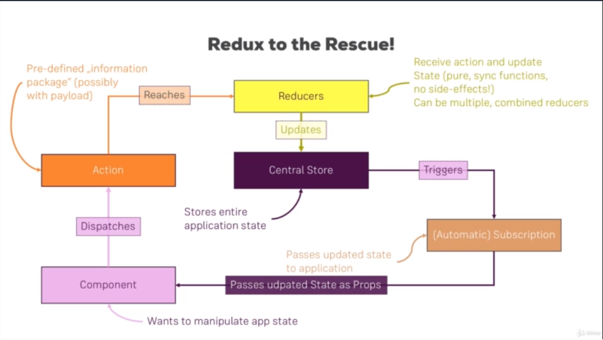

# React Bootcamp

1. A JS Library for building User Interfaces
   - Components are used to build User Interfaces
   - Think of components as custom html elements
1. [Official Documentation](https://reactjs.org/)
1. Why React?
   - UI State becomes difficult to handle w/ vanilla JS
   - Focus on business logic, not on preventing app from exploding
   - Huge ecosystem, active community, high performance
1. React Alternatives
   - Angular
   - Vue
   - Backbone
   - Ember

## Single Page Applications vs Multi-Page Applications

1. SPA
   - Only ONE HTML page, content is (re)rendered on Client
   - Page is built of components, each a react component
   - One ReactDOM.render() call
1. MPA
   - Multiple HTML page, content rendered on server
   - React would be used to create 'widgets'
   - Multiple ReactDOM.render calls since we'd have multiple 'widgets'

## Build Workflow

1. Dependency Manager
   - npm
1. Bundler
   - Webpack
1. Compiler (Next-Gen JS)
   - Babel + Presets
   - Hooked into Webpack
1. Use Development Server

# Creating a React App

1. Run the below function to create the app
   ```
   npx create-react-app my-app
   npm start
   ```
1. Two ways of creating a component
1. Class Based
   ```js
   class App extends Component {
   	render() {
   		return (
   			<div className="App">
   				<h1>Hi, I'm a react app</h1>
   			</div>
   		);
   	}
   }
   ```
   - Has state and lifecycle hooks
1. Functional (stateless)
   ```js
   function App() {
   	return (
   		<div className="App">
   			<h1>Hi, I'm a react app</h1>
   		</div>
   	);
   }
   ```
   - Can use hooks
   - Use this as often as you can
1. In the `index.js` class, you'll see this line
   ```js
   ReactDOM.render(
   	<React.StrictMode>
   		<App />
   	</React.StrictMode>,
   	document.getElementById('root')
   );
   ```
   - With react, we should only use this render function **once**
   - App would be considered our 'root' component
   - We would nest other componentes in root and each other

## Understanding JSX

1. Old school, crappy way w/o jsx
   ```js
   return React.createElement(
   	'div',
   	{ className: 'App' },
   	React.createElement('h1', null, `Hi, I'm a react app`)
   );
   ```
1. JSX allows us to pretend it's html
   ```js
   return (
   	<div className="App">
   		<h1>Hi, I'm a react app</h1>
   	</div>
   );
   ```
   - Looks like html, isn't html (it's js)
1. Restrictions
   - Can't use `class` since it's a reserved js word
     - Must use `className`
   - Must have one root element
1. You can input javascript into html code like so
   ```jsx
   return (
   	<p>I'm a Person and I am {Math.floor(Math.random() * 30)} years old!</p>
   );
   ```
   - Wrap in {}
   - Limited to single line js statements (which can be functions)

## React Props

1. What are props?
   ```js
   const person = (props) => {
   	return (
   		<p>
   			I'm {props.name} and I am {props.age} years old!
   		</p>
   	);
   };
   ```
   ```js
   <Person name="Gary" age="28" />
   <Person name="Row" age="1" />
   <Person name="Katie" age="30" />
   ```
1. Props children
   ```js
   const person = (props) => {
   	return (
   		<div>
   			<p>
   				I'm {props.name} and I am {props.age} years old!
   			</p>
   			<p>{props.children}</p>
   		</div>
   	);
   };
   ```
   ```
   <Person name="Gary" age="28">
      My Hobbies: Racing
   </Person>
   ```
1. Anything in between your component tags is 'children'
1. It can be complex html!

## State

1. State is a special property of a component class

   - Functions use 'hooks' to manage state

   ```js
   state = {
   	persons: [
   		{ name: 'Gary', age: 31 },
   		{ Name: 'Rowe', age: 1 },
   		{ name: 'Katie', age: 28 },
   	],
   };

   render() {
   	return (
   		<div className="App">
   			<h1>Hi, I'm a react app</h1>
   			<button>Switch Name</button>
   			<Person
   				name={this.state.persons[0].name}
   				age={this.state.persons[0].age}
   			>
   				My Hobbies: Racing
   			</Person>
   			<Person
   				name={this.state.persons[1].name}
   				age={this.state.persons[1].age}
   			/>
   			<Person
   				name={this.state.persons[2].name}
   				age={this.state.persons[2].age}
   			/>
   		</div>
   	);
   ```

1. When you update props it triggers an automatic re-rendering
1. When updating state, use setState instead of accessing values directly
   - Merges new values w/ original state
1. You don't want to manage state in very many places
   - Keep this limited to as few class components as possible

## Event Listeners

1. JSX event listeners
   - [Supported Events](https://reactjs.org/docs/events.html#supported-events)
   - The key is that event listeners don't look the same as regular JS
   ```js
   <button onClick={this.switchNameHandler}>Switch Name</button>
   ```
   - onClick vs onclick
   - Notice we aren't calling the function w/ parens
1. We are using the above event listener to demonstrate how state auto re-renders a react component
   ```js
   switchNameHandler = () => {
   	// DON'T do this
   	//this.state.persons[0].name = 'Hello';
   	this.setState({
   		persons: [
   			{ name: 'GArrrrry', age: 31 },
   			{ Name: 'Rowe', age: 1 },
   			{ name: 'Katie', age: 35 },
   		],
   	});
   };
   ```

## Method References Between Components

1. You can pass methods as properties between components

   ```js
   render() {
      return (
         <div className="App">
            <h1>Hi, I'm a react app</h1>
            <button onClick={() => this.switchNameHandler('Garrrrrry')}>
               Switch Name
            </button>
            <Person
               name={this.state.persons[0].name}
               age={this.state.persons[0].age}
               click={this.switchNameHandler.bind(this, 'Garrrry!')}
            >
               My Hobbies: Racing
            </Person>
            <Person
               name={this.state.persons[1].name}
               age={this.state.persons[1].age}
            />
            <Person
               name={this.state.persons[2].name}
               age={this.state.persons[2].age}
            />
         </div>
      );
   }
   ```

   ```js
   const person = (props) => {
   	return (
   		<div>
   			<p onClick={props.click}>
   				I'm {props.name} and I am {props.age} years old!
   			</p>
   			<p>{props.children}</p>
   		</div>
   	);
   };
   ```

1. Notice in the first snipped, we are using an arrow function and a bind function to pass switchNameHandler function
   - Try to use bind as often as possible
   - You may run into performance issues w/ arrow functions

## Two-way Binding

1. Person.js

   ```js
   const person = (props) => {
   	return (
   		<div>
   			<p onClick={props.click}>
   				I'm {props.name} and I am {props.age} years old!
   			</p>
   			<p>{props.children}</p>
   			<input type="text" onChange={props.changed} value={props.name} />
   		</div>
   	);
   };

   export default person;
   ```

   - Notice onChange and value

1. App.js
   - Handler
   ```js
   nameChangedHandler = (event) => {
   	this.setState({
   		persons: [
   			{ name: 'Gary', age: 31 },
   			{ name: event.target.value, age: 1 },
   			{ name: 'Katie', age: 35 },
   		],
   	});
   };
   ```
   - Person element
   ```
   <Person
      name={this.state.persons[1].name}
      age={this.state.persons[1].age}
      changed={this.nameChangedHandler}
   />
   ```
   - This allows us to type a value in the input field in the component and have it show up in the name filed

## Styling Components

1. Scoped styles must be 'inline' styles

   ```js
   render() {
         const style = {
            backgroundColor: 'white',
            font: 'inherit',
            border: '1px solid blue',
            padding: '8px',
            cursor: 'pointer',
         };

         return (
            <div className="App">
               <h1>Hi, I'm a react app</h1>
               <button
                  style={style}
                  onClick={() => this.switchNameHandler('Garrrrrry')}
               >
                  Switch Name
               </button>
            </div>
         );
      }
   ```

   - There are limitations to what can be done w/ css in this approach

1. You can define a css file
   - Global in scope
   ```js
   import './Person.css';
   ```

## Documentation

1. [Create React App](https://github.com/facebook/create-react-app)
1. [JSX](https://reactjs.org/docs/introducing-jsx.html)
1. [Rendering Elements](https://reactjs.org/docs/rendering-elements.html)
1. [Components and Props](https://reactjs.org/docs/components-and-props.html)
1. [Listenable Events](https://reactjs.org/docs/events.html)

# List and Conditionals

## Conditionals

1. We can use the fact that JSX is just javascript to do something like this:

   ```js
   {
   	this.state.showPersons ? (
   		<div>
   			<Person
   				name={this.state.persons[0].name}
   				age={this.state.persons[0].age}
   				click={this.switchNameHandler.bind(this, 'Garrrry!')}
   			>
   				My Hobbies: Racing
   			</Person>
   			<Person
   				name={this.state.persons[1].name}
   				age={this.state.persons[1].age}
   				changed={this.nameChangedHandler}
   			/>
   			<Person
   				name={this.state.persons[2].name}
   				age={this.state.persons[2].age}
   			/>
   		</div>
   	) : null;
   }
   ```

   - Somewhat ugly

1. The JavaScript way

   ```js
   let persons = null;

   if (this.state.showPersons) {
   	persons = (
   		<div>
   			<Person
   				name={this.state.persons[0].name}
   				age={this.state.persons[0].age}
   				click={this.switchNameHandler.bind(this, 'Garrrry!')}
   			>
   				My Hobbies: Racing
   			</Person>
   			<Person
   				name={this.state.persons[1].name}
   				age={this.state.persons[1].age}
   				changed={this.nameChangedHandler}
   			/>
   			<Person
   				name={this.state.persons[2].name}
   				age={this.state.persons[2].age}
   			/>
   		</div>
   	);
   }

   return (
   	<div className="App">
   		<h1>Hi, I'm a react app</h1>
   		<button style={style} onClick={this.togglePersonsHandler}>
   			Toggle Persons
   		</button>

   		{persons}
   	</div>
   );
   ```

   - Perferred way, much more elegant

## Lists

```js
if (this.state.showPersons) {
	persons = (
		<div>
			{this.state.persons.map((person, index) => {
				return (
					<Person
						name={person.name}
						age={person.age}
						click={() => this.deletePersonHanlder(index)}
					/>
				);
			})}
		</div>
	);
}
```

## Documentation

1. [Conditional Rendering](https://reactjs.org/docs/conditional-rendering.html)
1. [Lists & Keys](https://reactjs.org/docs/lists-and-keys.html)

# Styling React Components & Elements

- I don't understand why we don't just use...unique identifiers for our classes?
- We can still have separate css files, intellisense, etc
- What's the point of this shit down below?

1. You can style react elements with JS

   ```js
   const style = {
   	backgroundColor: 'green',
   	color: 'white',
   	font: 'inherit',
   	border: '1px solid blue',
   	padding: '8px',
   	cursor: 'pointer',
   };

   if (this.state.showPersons) {
      ...
      style.backgroundColor = 'red';
   }
   ```

1. Setting class names dynamically

   ```js
   const classes = [];

   if (this.state.persons.length <= 2) {
   	classes.push('red');
   }
   if (this.state.persons.length <= 1) {
   	classes.push('bold');
   }

   return (
   	<div className="App">
   		<h1>Hi, I'm a react app</h1>
   		<p className={classes.join(' ')}>This is really working!</p>
   		<button style={style} onClick={this.togglePersonsHandler}>
   			Toggle Persons
   		</button>

   		{persons}
   	</div>
   );
   ```

## Radium

```
npm install --save radium
```

1. Radium is called a 'higher order component'
1. Have to wrap your component with Radium
   ```js
   export default Radium(App);
   ```
1. Allows us to create complex styles (hover)
   ```js
   const style = {
   	backgroundColor: 'green',
   	color: 'white',
   	font: 'inherit',
   	border: '1px solid blue',
   	padding: '8px',
   	cursor: 'pointer',
   	':hover': {
   		backgroundColor: 'lightgreen',
   		color: 'black',
   	},
   };
   ```
   ```js
   style[':hover'] = {
   	backgroundColor: 'salmon',
   	color: 'black',
   };
   ```
1. Media Queries with Radium

   - Need to wrap your return component in `<StyleRoot>`

   ```js
   return (
   	<StyleRoot>
   		<div className="App">
   			<h1>Hi, I'm a react app</h1>
   			<p className={classes.join(' ')}>This is really working!</p>
   			<button style={style} onClick={this.togglePersonsHandler}>
   				Toggle Persons
   			</button>

   			{persons}
   		</div>
   	</StyleRoot>
   );
   ```

   ```js
   const style = {
   	'@media(min-width: 500px)': {
   		width: '450px',
   	},
   };
   ```

## Styled Components

[Link](https://styled-components.com/)

```
npm install --save styled-components
```

1. Alternative to Radium

```js
const StyledDiv = styled.div`
	width: 60%;
	margin: 16px auto;
	border: 1px solid #eee;
	box-shadow: 0 2px 3px #ccc;
	padding: 16px;
	text-align: center;

	@media (min-width: 500px) {
		width: 450px;
	}
`;
```

```
<StyledDiv>
   <p onClick={props.click}>
      I'm {props.name} and I am {props.age} years old!
   </p>
   <p>{props.children}</p>
   <input type="text" onChange={props.changed} value={props.name} />
</StyledDiv>
```

# Components and React Internals

Links below for lifecycle hooks

1. [useEffect()](https://reactjs.org/docs/hooks-effect.html)
   - Let you use state and other React features w/o writing a class
1. [State and Lifecycle](https://reactjs.org/docs/state-and-lifecycle.html)
1. [PropTypes](https://reactjs.org/docs/typechecking-with-proptypes.html)
1. [Higher-Order Components](https://reactjs.org/docs/higher-order-components.html)
1. [Refs and the DOM](https://reactjs.org/docs/refs-and-the-dom.html)

## Stateless (Functional) and Stateful (Class-Based) Components


## Component Lifecycle Creation

Class-based components only


## Component Lifecycle Update


# React and HTTP/AJAX

1. For SPAs, you don't reach out to a server to get html pages
   - Instead you get JSON Data
1. Multi-page apps works as expected w/ asking the server for pages
1. To test against a server (for testing http/ajax)
   - [JSON placeholder](https://jsonplaceholder.typicode.com/)
1. [axios](https://github.com/axios/axios)
   - Promise based http client
1. Best place for an http request?
   - componentDidMount hook

## Adding to Burger Builder

1. Using Firebase as our server/database
1. [Firebase Link](https://console.firebase.google.com/u/1/)
1. Using axios
   ```js
   const instance = axios.create({
   	baseURL: 'firebaseUrl',
   });
   ```
1. Firebase is like using mongo as an api

   ```js
   const order = {
   	ingredients: this.state.ingredients,
   	price: this.state.totalPrice,
   	customer: {
   		name: 'Gary Hake',
   		address: {
   			stree: 'Teststreet 1',
   			zipCode: '40223',
   			country: 'America',
   		},
   		email: 'test@test.com',
   	},
   	deliveryMethod: 'fastest',
   };

   axios
   	.post('/orders.json', order)
   	.then(() => {
   		this.setState({ loading: false, purchasing: false });
   	})
   	.catch((err) => {
   		this.setState({ loading: false, purchasing: false });
   		console.log(err);
   	});
   ```

1. You don't have to create the orders 'table' beforehand

# Routing

Making a SPA feel like a MPA


[React Router](https://reactrouter.com/web/guides/quick-start)

[React Router Philosophy](https://reactrouter.com/web/guides/philosophy)

1. Install router package
   ```
   npm install --save react-router react-router-dom
   ```
   - Not created by fb, but de-facto pkg for routing
   - Actually don't need react-router, react-router-dom wraps react-router
1. Using the router package

   - app.js or index.js

   ```js
   import React, { Component } from 'react';
   import { BrowserRouter } from 'react-router-dom';

   import Blog from './containers/Blog/Blog';

   class App extends Component {
   	render() {
   		return (
   			<BrowserRouter>
   				<div className="App">
   					<Blog />
   				</div>
   			</BrowserRouter>
   		);
   	}
   }

   export default App;
   ```

1. Create Route element

   ```js
   <Route path="/" exact render={() => <h1>Home</h1>} />
   ```

   - exact makes the url match the path exaclty

1. Query Parameters

   ```js
   <Link to="/my-path?start=5">Go to Start</Link>

   <Link
      to={{
         pathname: '/my-path',
         search: '?start=5'
      }}
      >Go to Start
   </Link>
   ```

   ```js
   componentDidMount() {
      const query = new URLSearchParams(this.props.location.search);
      for (let param of query.entries()) {
         console.log(param); // yields ['start', '5']
      }
   }
   ```

1. Lazy Loading

   - Loading pages only when requested

   ```js
   import React, { Component } from 'react';

   const asyncComponent = (importComponent) => {
   	return class extends Component {
   		state = {
   			component: null,
   		};

   		componentDidMount() {
   			importComponent().then((cmp) => {
   				this.setState({ component: cmp.default });
   			});
   		}

   		render() {
   			const C = this.state.component;

   			return C ? <C {...this.props} /> : null;
   		}
   	};
   };

   export default asyncComponent;
   ```

   ```js
   const asyncNewPost = asyncComponent(() => {
   	return import('./NewPost/NewPost');
   });
   ```

# Forms and Validation

React doesn't have its own built in validation, so you have to write your own, or include a separate package

1. [Validate.js](https://validatejs.org/)
1. [React-Validation](https://www.npmjs.com/package/react-validation)
1. [Validation Ideas](https://react.rocks/tag/Validation)

## Manual Approach

1. State Object
   ```js
   email: {
      elementType: 'input',
      elementConfig: {
         type: 'email',
         placeholder: 'Your E-Mail',
      },
      value: '',
      validation: {
         required: true,
      },
      valid: false,
      touched: false,
   },
   ```
1. Validation Function

   ```js
   checkValidation(value, rules) {
   	let isValid = true;

   	if (rules.required) {
   		isValid = value.trim() !== '' && isValid;
   	}

   	if (rules.minLength) {
   		isValid = value.length >= rules.minLength && isValid;
   	}

   	if (rules.maxLength) {
   		isValid = value.length <= rules.maxLength && isValid;
   	}

   	return isValid;
   }
   ```

1. Inside input changed handler

   ```js
   for (let inputIdentifier in updatedOrderForm) {
   	formIsValid = updatedOrderForm[inputIdentifier].valid && formIsValid;
   }

   this.setState({ orderForm: updatedOrderForm, formIsValid: formIsValid });
   ```

In general when you create a form with input fields, you need to validate them somehow!

# Redux

1. Stand-alone 3rd party library
1. Often used with React
1. Makes state management easier
1. Uses a central store for state
   - Stores entire app state



1. To use redux in react you need two packages

   ```
   npm install --save redux
   npm install --save react-redux
   ```

   - redux is standalone, but react-redux lets you hook them together

   ```js
   import { createStore } from 'redux';
   import { Provider } from 'react-redux';
   import reducer from './store/reducer';

   const store = createStore(reducer);

   ReactDOM.render(
   	<Provider store={store}>
   		<App />
   	</Provider>,
   	document.getElementById('root')
   );
   ```

1. [Redux DevTools](https://chrome.google.com/webstore/detail/redux-devtools/lmhkpmbekcpmknklioeibfkpmmfibljd?hl=en)

## Immutable Update Patterns

[Official Documentation](https://redux.js.org/recipes/structuring-reducers/immutable-update-patterns/)

Ultimately we don't want to update state directly. Instead we want to copy, update, then set

## When to Use Redux


## Data Transforming Logic


1. Should be in reducer
1. Could put in action
1. Be consistent no matter which path you take

## Documentation

1. [Redux Docs](https://redux.js.org/)
1. [Core Concepts](https://redux.js.org/introduction/core-concepts)
1. [Actions](https://redux.js.org/tutorials/fundamentals/part-2-concepts-data-flow)
1. [Reducers](https://redux.js.org/tutorials/fundamentals/part-3-state-actions-reducers)
1. [Middleware](https://redux.js.org/tutorials/fundamentals/part-4-store#middleware)
1. [Redux Thunk](https://github.com/reduxjs/redux-thunk)
   - Async actions
   - Actions return a function that will eventually dispatch a function
   - 'eventually' = async
1. [Async Actions](https://redux.js.org/tutorials/fundamentals/part-6-async-logic)

# Testing React Apps

1. Test Runner
   - [Jest](https://jestjs.io/docs/tutorial-react)
1. Test Utilities (Simulate React App)
   - React Test Utils
   - [Enzyme](https://enzymejs.github.io/enzyme/)
